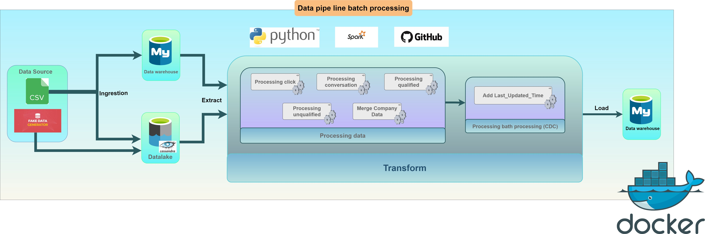
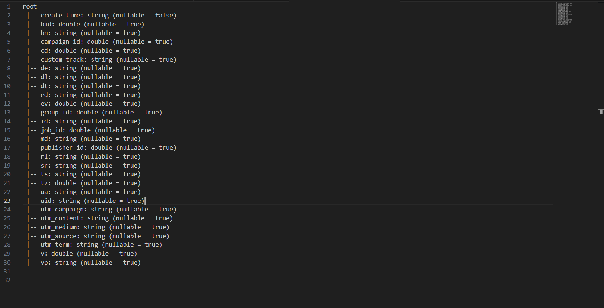

# The_system_processes_and_analyzes_log_data_from_the_Online_Recruitment_Platform
## Objective
This project focuses on building a data processing and analysis system from log data from users of a recruitment website. The main goal is to store, process, analyze that log data and decide the next step of the business development.
Kafka for the messaging queue and put the raw data to Cassandra (Data Lake), PySpark for transforming the data from Cassandra then put the processed data to MySQL, MySQL for data warehousing, Airflow for scheduling the Python scripts. Visualizing Data with Grafana. Using Docker to deploy the project easily.
- Tech stack: PySpark, Airflow, Kafka, Docker, Cassandra, MySQL, Grafana, Python.

## Architecture
  

### Raw Data
- Log data from the website is processed near real-time into Data Lake is Cassandra.
- Log data schema
```sh
.
root
 |-- create_time: string (nullable = false)
 |-- bid: integer (nullable = true)
 |-- bn: string (nullable = true)
 |-- campaign_id: integer (nullable = true)
 |-- cd: integer (nullable = true)
 |-- custom_track: string (nullable = true)
 |-- de: string (nullable = true)
 |-- dl: string (nullable = true)
 |-- dt: string (nullable = true)
 |-- ed: string (nullable = true)
 |-- ev: integer (nullable = true)
 |-- group_id: integer (nullable = true)
 |-- id: string (nullable = true)
 |-- job_id: integer (nullable = true)
 |-- md: string (nullable = true)
 |-- publisher_id: integer (nullable = true)
 |-- rl: string (nullable = true)
 |-- sr: string (nullable = true)
 |-- ts: string (nullable = true)
 |-- tz: integer (nullable = true)
 |-- ua: string (nullable = true)
 |-- uid: string (nullable = true)
 |-- utm_campaign: string (nullable = true)
 |-- utm_content: string (nullable = true)
 |-- utm_medium: string (nullable = true)
 |-- utm_source: string (nullable = true)
 |-- utm_term: string (nullable = true)
 |-- v: integer (nullable = true)
 |-- vp: string (nullable = true)
```


### Processing Data
Read and review the data recording user actions in the log data, notice that there are actions with analytical value in the column ```["custom_track"]``` including: ```clicks, conversion, qualified, unqualified```.
Processing raw data to obtain valuable clean data:
- Filter actions with analytical value in column ```["custom_track"]``` including: ```clicks, conversion, qualified, unqualified```.
- Remove null values, replace with 0 to be able to calculate.
- Calculate the basic values of data for in-depth analysis.
- Use pySpark to write Spark jobs and process data efficiently.
- Data after processing is saved to Data Warehouse is MySQL for storage and in-depth analysis.
- Use airflow to schedule Spark-jobs every 6 Am every day.

### Clean data
- Clean Data schema
```sh
.
root
 |-- job_id: integer (nullable = true)
 |-- dates: timestamp (nullable = true)
 |-- hours: integer (nullable = true)
 |-- disqualified_application: integer (nullable = true)
 |-- qualified_application: integer (nullable = true)
 |-- conversion: integer (nullable = true)
 |-- company_id: integer (nullable = true)
 |-- group_id: integer (nullable = true)
 |-- campaign_id: integer (nullable = true)
 |-- publisher_id: integer (nullable = true)
 |-- bid_set: double (nullable = true)
 |-- clicks: integer (nullable = true)
 |-- impressions: string (nullable = true)
 |-- spend_hour: double (nullable = true)
 |-- sources: string (nullable = true)
 |-- latest_update_time: timestamp (nullable = true)
```


### Visualizing Data with Grafana


## Setup
### Pre-requisite
#### Kafka setup
- Read instructions in file ```kafka\Run kafka sever.txt```.
#### Spark setup
- Install Spark (used 3.4.0)
#### Airflow setup
- Install Airflow in Docker Compose
#### Cassandra setup
- Install Cassandra
#### MySQL setup
- Install MySQL
## Get Going!
- Setup Kafka service and start sending log data from website [Setup](setup/kafka.md)
- Setup Airflow to trigger the daily data pipeline [Setup](setup/airflow.md)
- Setup Grafana for data visualization [Setup](setup/grafana.md)

 